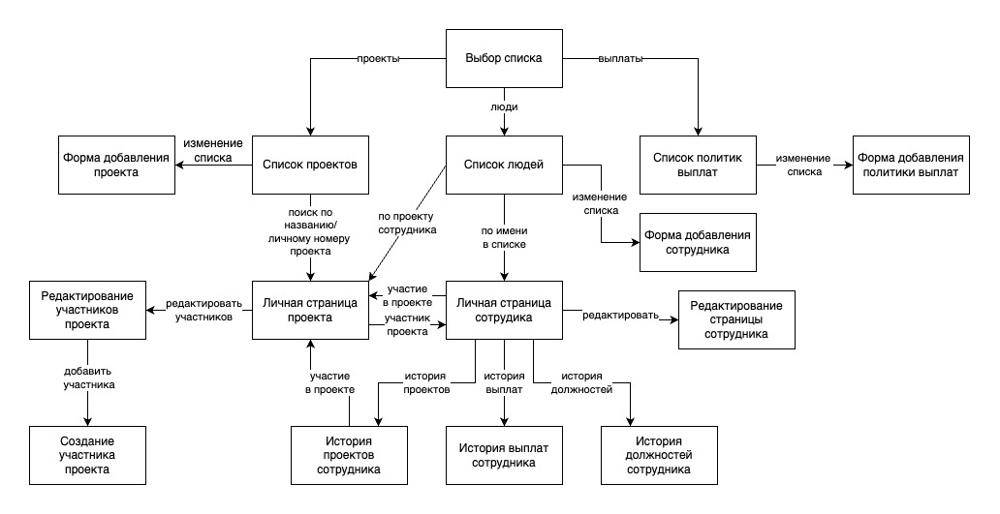

# Схема навигации

## Выбор списка
- ссылка на список всех проектов
- ссылка на список сотрудников
- ссылка на список политик выплат

## Список проектов
- ссылка на страницу, позволяющую добавить новый проект
- ссылка на личную страницу проекта с помощью поиска по имени проекта или его номера
- список проектов содержит названия проектов и их номера. Оба поля являются ссылками на личную страницу проекта

## Список политик выплат
- ссылка на страницу, позволяющую добавить новую политику выплат
- есть возможность перевести страницу в режим редактирования, где появляется возможность изменить сумму выплат, а так же удалить политику
- список политик выплат содержит названия политик и сумму их выплат

## Список людей
- ссылка на страницу, позволяющую добавить нового сотрудника
- ссылка на личную страницу сотрудника с помощью поиска по его имени, личному номеру, должности и т.д.
- возможность фильтрации сотрудников по должности
- список сотрудников содержит личный номер сотрудника, его имя и должность. Имя сотрудника и его номер являются ссылками на личную страницу сотрудника

## Форма добавления проекта
- страница просит указать данные проекта: его название, даты начала и конца, его статус (активен/не активен)
- переход на список проектов (и добавление нового проекта в этот список)

## Форма добавления политики выплат
- страница просит указать тип политики (по роли в проекте, по должности, по особому случаю)
- область ввода необходимых данных исходя из выбора типа новой политики
- переход на список политик (и добавление новой политики в этот список)

## Форма добавления нового сотрудника
- страница просит указать личные данные сотрудника, а так же дает выбрать ему должность исходя из существующих политик выплат "по должности"
- переход на список сотрудников (и добавление нового сотрудника в этот список)

## Личная страница проекта
- содержит данные проекта: название, статус проекта(активен/не активен), дата начала проекта(и его конца, если проект уже завершен или имеет срок выполнеия)
- список участников проекта: их личные номера, имена, роли в проекте, дата начала работы над проектом(и дата конца работы над проектом, если участник был переведен на другую роль, уволен или работает на проекте по контракту определенное время), а так же статус данного участника(активен/ не активен, в зависимости от того актуальна ли роль участинка или его участие в проекте на настоящий момент времени). Личный номер участников проекта и их имена являются ссылками на личную страницу данного участника
- есть возможность перевести страницу в режим редактирования, чтобы изменить данные проекта, добавить/уволить участников, удалить проект

## Личная страница сотрудника
- актуальные данные сотрудника: все личные данные, актуальная должность, проект, роль в проекте, заработная плата за последний месяц работы. Проект является ссылкой на личную страницу проекта
- ссылка на историю проектов, в которых принимал участие работник
- ссылка на историю всех выплат сотруднику
- ссылка на историю должностей сотрудника
- есть возможность перевести страницу в режим редактирования, чтобы изменить данные сотрудника или уволить его

## История проектов сотрудника
- страница содержит все проекты сотрудника, его роли на этих проектах и даты, когда сотрудник занимал такой статус
- названия проектов являются ссылками на личные страницы этих проектов

## История выплат сотрудника
- страница содержит все данные о выплатах сотруднику: политики выплат, сумму начислений и даты, когда были произведены начисления

## История должностей сотрудника
- страница содержит все должности сотрудника и даты, когда сотрудник занимал их
   
